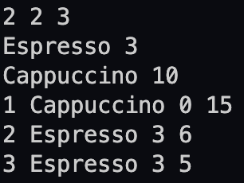
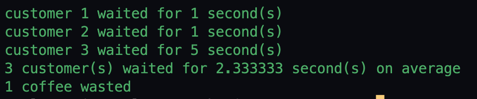

# Concurrency report

## Cafe Sim

`implementation of the cafe sim`
- in my implementation i have one que for the customer and one que for the barista which have all the details of the customer and barista and at the start of the simulation i have to read the input file and store the data of the input file in the que of the customers and barista.
- i have total n+b threads in my simulation where n is the number of customers and b is the number of barista after this i start all the threads of the barista and start the threads of the customers when the arrival time of the customer is equal to the current time of the simulation and there is also timer thread.
- now barista thread is waiting for the customer thread to start and after that barista takes the order of the customer and start preparing the order of the customer and after the completion of the order of the customer barista takes the next order of the customer.
- after the completion of the order of the customer , customer leaves the cafe with or without getting the order by checking the tolerance time of the customer means if the customer get the order before the tolerance time of the customer then customer leaves the cafe with the order and if the customer didnot get the order before the tolerance time of the customer then customer leaves the cafe without getting the order.
- for the ordering of the barista to take the order of the customer i have used the semaphore and also check that the other barista is busy which have lower id number than the current barista. same for the customer ordering to the barista.

``assumptions``
- if the customer is leaving at t seconds and it's tolerance time is tiil the t-1 second then if it's order is completed by t-1 seconds the it will leave with order and if it's order is completed by t seconds then it will leave without order.

``Observation 1``
- for Calculate the average time a customer spends waiting for their coffee we have to calculate time of each customer till the any barista start preparing the order of customer from the arrival time of the customer.
- if the any customer didnot get response from the barista then we have to calculate the time of customer till the tolerance time of the customer.
- by the end of the simulation we have to calculate the average time of all the customers.
- at the end of simulation i print the waiting time of all the customers and the average time of all the customers.
- if there is infinite barista the average time of the customer is less than the finite barista and in this case the avg_waiting_time is 0.0 because all the customers is accepted by the barista at the arrival time of the customer.

    

       


``Observation 2``
- for Determine how many coffees are wasted we have to calculate the number of customers who leave the cafe without getting the coffee and barista is preparing the coffee of the customer.
- at the end of simulation i print the number of customers who leave the cafe without getting the coffee and barista is preparing the coffee of the customer.

## Ice Cream Parlor Sim

`implementation of Ice Cream Parlor Sim`
- in my implementation i have one que for the customer and one que for the machine which have all the details of the customer and machine and at the start of the simulation i have to read the input file and store the data of the input file in the que of the customers and ice cream maker.
- i have total customers+machine threads in my simulation after this i start all the threads of the ice cream maker and start the threads of the customers when the arrival time of the customer is equal to the current time of the simulation.
- in machine thread is in sleep mode till the arrival time of that machine and after the start of the machine thread it checks the order of the customer and if the toppings of the ice cream is sufficient then machine start preparing the ice cream of the customer and after the completion of the ice cream of the customer machine start preparing the ice cream of the next customer or same customer depends on the order of the customer.
- if the toppings of the ice cream is not sufficient then machine reject the order of the customer and customer leaves the parlor without getting the ice cream.
- while taking order machine also checks that the preparation time of the order is not greater than the end time of the machine if it is then machine rejects the orders of the customer.
- for the ordering of the machine to take the order of the customer i have used the semaphore and also check that the other machine is busy which have lower id number than the current machine. same for the customer ordering to the machine.
- for the capacity of the parlor i used the counter if the counter is equal to the capacity of the parlor then we reject the customer and customer leaves the parlor without enters the parlor.
- for the deadlocks i have used the semaphore and locks for the ordering of the machine and customer and checking the toppings of the ice cream and also for the capacity of the parlor.
- when all the machine is closed then i close the parlor.

``assumptions``
- i didnot check the all the orders of the customer if the machine is busy only checks the order of the customer if machine is free and if the one order of the customer is rejected then i reject the all the orders of that customer.
- in my code there is also this implementation but it is commented because not assure that it is required or not.

```Minimizing Incomplete Orders:```
- we can minimize the incomplete orders by increasing the no of times of checking of the toppings of the ice cream means we can check the all the toppings of the all the orders of the customers even if the machine is busy and can't check the toppings of the ice-creams of the customer.
- we can also checks if the toppings are sufficient but the machine is not available then we can checks that if we can't fulfill the order of the customer by end of the parlor then we can reject the order of the customer at the arrival time of the customer so that customer don't have to wait and also not increase the conter of the present customers of the parlor.

```Ingredient Replenishment```
- we can say that if we replenish the ingredients of the ice cream then we checks that if the the total time of the replenishment of the ingredients plus the preparation time of the ice-creams is less than the end time of the parlor then we can accept the order of the customer otherwise we reject the order of the customer at the arrival time of the customer so that customer don't have to wait and also not increase the capacity of the parlor.

```Unserviced Orders```
- same as the discribed above we can reject the order of the customer at the arrival time of the customer by checking the toppings and the machine closing time so that customer don't have to wait and also not increase the capacity of the parlor.


